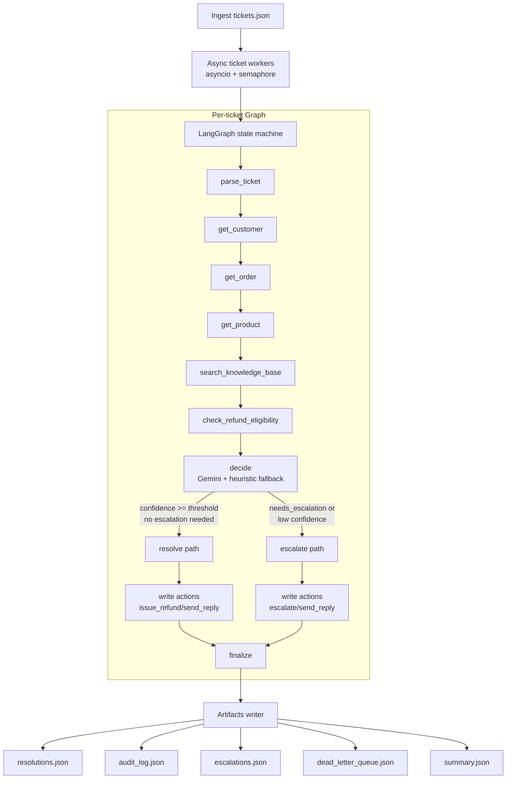

# ShopWave Autonomous Support Agent Architecture

## 1. High-Level Diagram

## 2. Orchestration Model

- Runtime: `main.py` runs all tickets concurrently via `asyncio.gather`.
- Concurrency control: semaphore-based max parallelism (`--max-concurrency`).
- Reasoning loop: LangGraph nodes execute deterministic tools first, then LLM decisioning.
- Routing: confidence-aware conditional edge sends uncertain/risky cases to escalation.

## 3. Tool Design

Read/lookup mocks:
- `get_customer(email)`
- `get_order(order_id)`
- `get_product(product_id)`
- `search_knowledge_base(query)`
- `check_refund_eligibility(order_id)`

Write/act mocks:
- `issue_refund(order_id, amount)` (guarded by eligibility checks)
- `send_reply(ticket_id, message)`
- `escalate(ticket_id, summary, priority)`

Reliability behavior built into every tool call:
- deterministic failure injection (timeout, malformed payload, partial payload)
- schema validation of tool outputs before use
- retry budget with exponential backoff (`TOOL_RETRY_BUDGET`, default 2)
- explicit retry/error audit entries for explainability

## 4. State and Memory

Per-ticket state (`TicketState`) stores:
- input context (`ticket`, `customer`, `order`, `product`)
- reasoning artifacts (`eligibility`, `decision`, `knowledge_snippets`)
- execution artifacts (`final_response`, `reply_outbox`, `escalation_queue`, `last_refund`)
- observability (`audit`, `tool_call_count`, `retry_counters`, `errors`)
- resilience flags (`escalated`, `dead_lettered`)

This keeps decisions explainable and reproducible at ticket granularity.

## 5. Audit and Explainability

Every significant step writes an audit event with:
- timestamp
- tool name
- tool input
- tool output or failure metadata
- confidence

This includes retries, fallback paths, and dead-letter marking events.

## 6. Failure Containment

- Tool-level failures are handled locally and retried.
- Eligibility tool failures degrade to safe escalation.
- Write-action failures trigger escalation and dead-letter logging.
- Pipeline-level exceptions do not crash the run; they produce safe fallback outputs.
